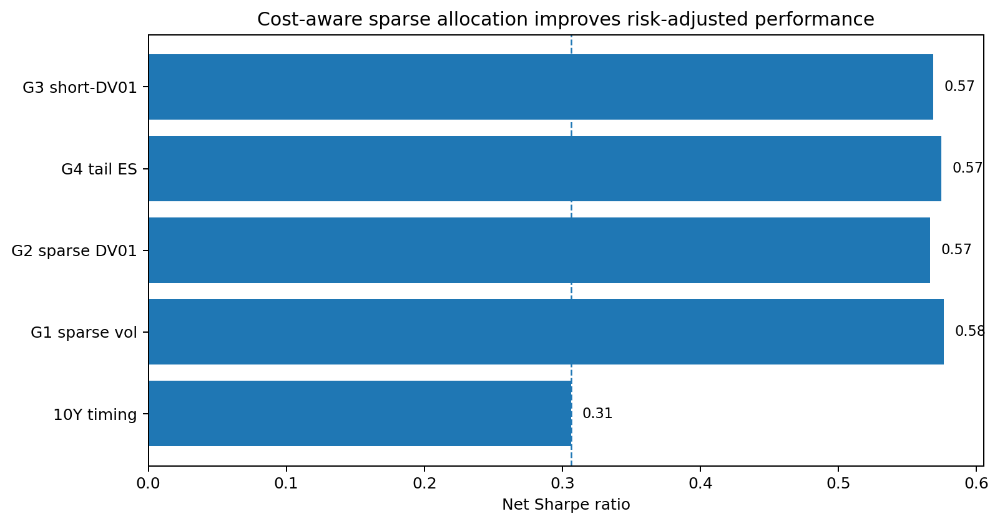
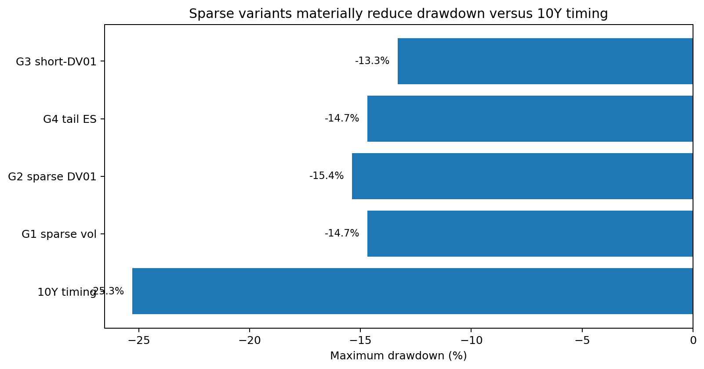
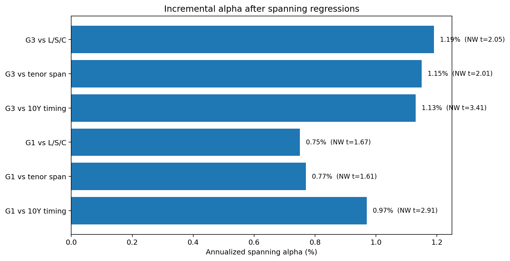
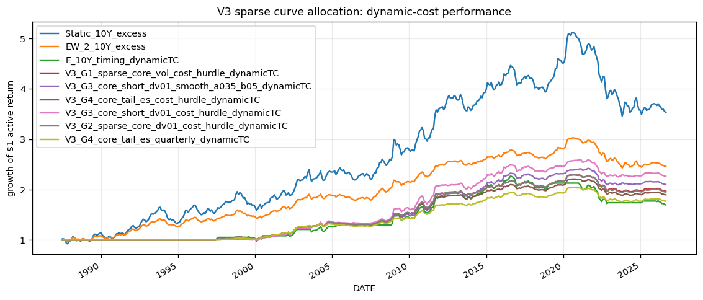
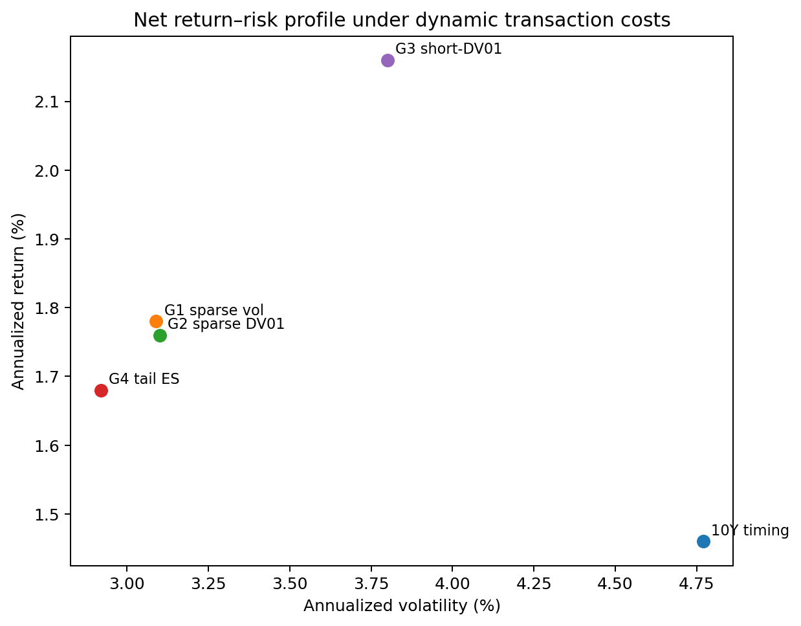

# MacroAnchor Sparse Curve Allocation

**Cost-aware sparse yield-curve allocation built on macro-anchored term-premium forecasts.**

This repository isolates the **portfolio-construction layer** of the broader Macro-Anchored Bond Risk Premia research program. The parent project asks whether a macro-consistent short-rate anchor contains information about future bond excess returns. This project asks the next question:

> **Can the cross-tenor forecast surface be converted into a sparse, implementable bond portfolio that improves on simple 10Y timing — and does the portfolio-construction layer add incremental return beyond the parent signal and standard curve exposures?**

The current evidence says **yes for the parent-signal comparison, with more qualified evidence against stricter static-tenor and curve-factor spans**.

---

## Headline result

The mechanically selected headline specification is the **G1 sparse-core conditional-volatility allocator with an implementation hurdle**, evaluated net of the dynamic transaction-cost proxy.

| Strategy | Ann. return | Ann. vol | Sharpe | MaxDD | NW t-stat | Ann. turnover |
|---|---:|---:|---:|---:|---:|---:|
| 10Y timing benchmark | **1.46%** | 4.77% | 0.31 | -25.28% | 1.68 | 0.69x |
| **G1 sparse allocator** | **1.78%** | **3.09%** | **0.58** | **-14.68%** | **2.59** | 1.65x |
| G2 DV01-risk variant | 1.76% | 3.10% | 0.57 | -15.37% | 2.53 | 1.65x |
| G4 tail-ES variant | 1.68% | **2.92%** | 0.57 | -14.68% | 2.57 | 1.68x |
| G3 short-DV01 challenger | **2.16%** | 3.80% | 0.57 | **-13.31%** | **2.77** | 3.46x |

The headline G1 allocator therefore improves the parent 10Y timing implementation on **Sharpe, volatility, drawdown and mean-return significance**, while keeping the construction sparse and interpretable.





---

## The new result: incremental alpha from portfolio construction

V4 adds three pre-specified spanning regressions with **Newey-West/HAC inference (12 monthly lags)**:

1. **Parent-signal spanning:** sparse allocator vs the cost-aware 10Y timing strategy.
2. **Eligible-tenor spanning:** sparse allocator vs a static linear combination of the same 2Y/3Y/5Y/7Y/10Y excess-return series available to the allocator.
3. **Curve-factor spanning:** sparse allocator vs fixed Level/Slope/Curvature factor-mimicking portfolios. Factor loadings are estimated once using pre-evaluation yield changes and then frozen.

### Headline G1 allocator

| Spanning test | Alpha p.a. | NW t-stat | R² | Interpretation |
|---|---:|---:|---:|---|
| vs 10Y timing | **0.97%** | **2.91** | 72.7% | strong evidence that sparse construction adds return beyond the parent timing rule |
| vs eligible tenor span | 0.77% | 1.61 | 56.1% | positive residual alpha; suggestive rather than decisive |
| vs Level/Slope/Curvature | 0.75% | 1.67 | 56.1% | positive residual alpha after standard curve-factor exposures; suggestive |

The important distinction is that the G1 allocator is **not merely a lower-volatility repackaging of the 10Y signal**: it retains about **1% annualized HAC alpha** against the parent implementation.

### G3 short-DV01 challenger

The higher-turnover G3 specification is statistically stronger in the spanning tests:

| Spanning test | Alpha p.a. | NW t-stat | R² |
|---|---:|---:|---:|
| vs 10Y timing | **1.13%** | **3.41** | 77.7% |
| vs eligible tenor span | **1.15%** | **2.01** | 41.0% |
| vs Level/Slope/Curvature | **1.19%** | **2.05** | 41.0% |

G3 is therefore a useful **challenger / falsification result**: incremental alpha survives even against the stricter static-tenor and curve-factor spans. It is not the headline portfolio because turnover is roughly twice G1 and the short-hedge layer is more implementation-sensitive.



---

## Research design

The construction is intentionally sparse rather than a generic optimizer:

```text
macro anchor
    ↓
model-implied term-premium forecasts by tenor
    ↓
rank forecasted excess returns across 2Y / 3Y / 5Y / 7Y / 10Y
    ↓
select strongest pure-return tenor as the core
    ↓
add satellite tenors only when they improve the risk-adjusted objective
    ↓
conditional volatility / DV01-shock / tail-ES risk controls
    ↓
smoothing + no-trade bands + cost hurdles + quarterly variants
    ↓
dynamic transaction costs
    ↓
spanning tests vs parent signal, eligible tenor span and L/S/C factors
```

The core principle is **forecast first, construction second**. The allocator does not diversify mechanically: additional tenors are accepted only when the marginal improvement is sufficient.

---

## What the project establishes

**Supported by the current run**

- Sparse curve allocation materially improves the risk-adjusted profile of the 10Y timing benchmark.
- Conditional return-volatility, DV01/yield-shock and tail-ES objectives lead to broadly consistent sparse allocations.
- The headline G1 allocator retains statistically significant incremental alpha versus the parent 10Y timing strategy.
- The G3 challenger retains alpha at roughly the 2-sigma level against both the eligible-tenor return span and fixed Level/Slope/Curvature factors.
- Transaction-cost controls reduce turnover materially relative to the raw greedy construction.

**Not claimed**

- This is **not** a duration-neutral relative-value strategy.
- Positive G1 alpha against the eligible-tenor and L/S/C spans is **suggestive**, not 5%-level evidence.
- The cost model is an implementation proxy, not an executable quote stream.
- This is not a production trading system.

For duration-neutral curve relative value, see the separate `macroanchor-curve-relative-value` project.

---

## Figures

### Net cumulative performance

The executed notebook reports cumulative active returns for the main sparse variants and benchmarks under the dynamic cost model.



### Return-risk profile



---

## Repository structure

```text
macroanchor-sparse-curve-allocation/
├── README.md
├── LICENSE
├── CITATION.cff
├── requirements.txt
├── environment.yml
├── notebooks/
│   ├── 01_cost_aware_sparse_curve_allocation_v4_spanning_executed.ipynb
│   └── archive/
│       ├── 00_v2_sparse_greedy_parallel_executed.ipynb
│       ├── 00_v3_cost_aware_sparse_greedy_executed.ipynb
│       └── reference_stress_weighted_sparse_saa.ipynb
├── docs/
│   ├── methodology.md
│   ├── results_and_spanning.md
│   ├── transaction_costs.md
│   ├── claims_and_limitations.md
│   ├── relation_to_parent_project.md
│   ├── replication_guide.md
│   └── roadmap.md
├── outputs/
│   ├── tables/
│   │   ├── headline_performance.csv
│   │   ├── headline_spanning.csv
│   │   ├── performance_dynamic_cost.csv
│   │   ├── spanning_summary_full.csv
│   │   ├── spanning_betas_headline.csv
│   │   ├── curve_factor_loadings.csv
│   │   └── attribution_dynamic_cost.csv
│   └── figures/
│       ├── headline_sharpe.png
│       ├── headline_max_drawdown.png
│       ├── spanning_alpha.png
│       ├── return_volatility.png
│       └── cumulative_performance.png
└── data/
    └── README.md
```

---

## Main notebook

`notebooks/01_cost_aware_sparse_curve_allocation_v4_spanning_executed.ipynb` is the current research notebook. It contains the full workflow:

- public curve/macro data retrieval and caching;
- macro-anchor construction;
- affine/Hull-White-style term-premium signal formation;
- cross-tenor expected-return scoring;
- sparse greedy allocators G1–G4;
- smoothing, no-trade and implementation-hurdle variants;
- dynamic transaction-cost estimates;
- return attribution;
- Newey-West mean tests;
- parent-signal, tenor-space and curve-factor spanning regressions.

The archived V2/V3 notebooks are retained only to document the research path and are not required for the current result.

---

## Data and transaction costs

The main curve data use public U.S. Treasury/FRED series. Raw data are not redistributed. See [`data/README.md`](data/README.md).

The headline dynamic cost layer uses **lagged Corwin-Schultz high-low spread estimates on liquid Treasury ETF proxies**, translated to one-way costs. Fixed-bps assumptions remain useful as sensitivity checks. Because constant-maturity Treasury data do not contain executable bid/ask quotes, transaction-cost results should be interpreted as **implementation diagnostics**, not live execution estimates.

See [`docs/transaction_costs.md`](docs/transaction_costs.md) for details.

---

## Reproducibility

```bash
pip install -r requirements.txt
jupyter notebook notebooks/01_cost_aware_sparse_curve_allocation_v4_spanning_executed.ipynb
```

The notebook caches public downloads locally. A fresh rerun can differ slightly from the committed executed notebook because public macro/market series can be revised or extended.

See [`docs/replication_guide.md`](docs/replication_guide.md).

---

## Relation to the parent research

This repository does **not** duplicate the main Macro-Anchored Bond Risk Premia paper. The research stack is deliberately separated:

```text
Macro-Anchored Bond Risk Premia
    signal formation / OOS bond-return predictability
             │
             ├── MacroAnchor Sparse Curve Allocation
             │      sparse, cost-aware portfolio construction
             │
             └── MacroAnchor Curve Relative Value
                    duration-neutral residual curve tests
```

That separation matters: the sparse allocator is allowed to carry duration risk because its object is **portfolio construction**, not market neutrality.

---

## Current research frontier

The next highest-value test is **stability of spanning alpha across subperiods / rolling windows**, especially for G1 and G3. The objective is not to search for a new strategy, but to determine whether incremental alpha is persistent or concentrated in a small number of regimes.

See [`docs/roadmap.md`](docs/roadmap.md).

---

## Disclaimer

Research and educational use only. This repository is not investment advice, not a production trading system, and not a recommendation to transact in any security or derivative.
